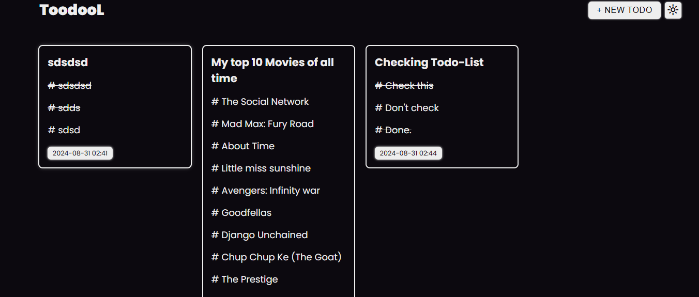
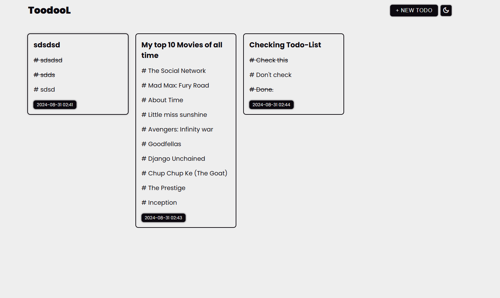
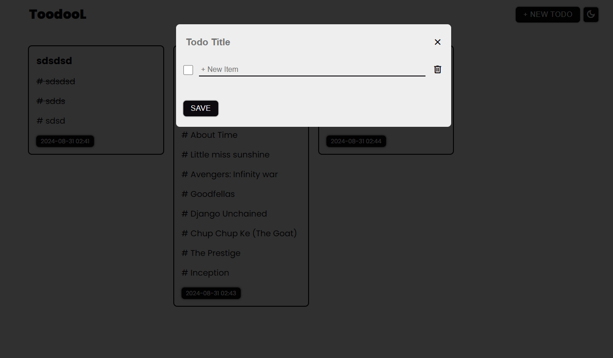

# ToodooL

> A minimalistic, elegant todo list application built with vanilla JavaScript

[](https://theankushgautam.github.io/Toodool/)
[](LICENSE)

## Overview

ToodooL is a lightweight, feature-rich todo list application that helps you organize your tasks efficiently. Built with vanilla JavaScript and modern web technologies, it provides a clean interface with dark/light theme support and persistent local storage. No backend, no accounts, no tracking—just pure, simple task management in your browser.

## Features

- ✅ Create and organize multiple todo lists with custom titles
- ✅ Add multiple items per todo with completion tracking
- ✅ Light/Dark theme toggle for comfortable viewing
- ✅ Automatic local storage persistence—your todos survive page refreshes
- ✅ Clean, minimalistic UI with Material Symbols icons
- ✅ Fully responsive design for desktop, tablet, and mobile
- ✅ Date/time tracking for each todo
- ✅ Real-time validation and instant feedback
- ✅ Zero dependencies on external data services

## Screenshots

### Light Theme


### Dark Theme


### Todo Form


## Live Demo

Check out the live version: **[ToodooL](https://theankushgautam.github.io/Toodool/)**

Create todos, toggle your theme, and refresh your browser—your data persists!

## Tech Stack

### Core Technologies
- **JavaScript (ES6+)**: Modern class-based architecture with modules
- **HTML5**: Semantic markup for accessibility and structure
- **CSS3**: Custom properties (variables), flexbox, smooth transitions, and responsive design

### Build & Development
- **Webpack 5**: Module bundling, asset management, and code optimization
- **webpack-dev-server**: Hot module reloading for seamless development experience
- **HtmlWebpackPlugin**: Dynamic HTML template processing
- **MiniCssExtractPlugin**: CSS extraction and optimization
- **CleanWebpackPlugin**: Automatic build directory cleanup

### Libraries & Tools
- **date-fns**: Lightweight date formatting library
- **Material Symbols**: Google's comprehensive icon system
- **ESLint**: Code quality and consistency enforcement
- **gh-pages**: Automated GitHub Pages deployment

## Installation

### Prerequisites
- Node.js (v14 or higher)
- npm or yarn package manager
- Git

### Setup Instructions

1. **Clone the repository**
   ```bash
   git clone https://github.com/theankushgautam/Toodool.git
   cd Toodool
   ```

2. **Install dependencies**
   ```bash
   npm install
   ```

3. **Start development server**
   ```bash
   npm start
   ```
   The app will automatically open at `http://localhost:8080` with hot reloading enabled.

4. **Build for production**
   ```bash
   npm run build
   ```
   Optimized files will be generated in the `dist/` directory.

## Usage

### Creating a Todo List

1. Click the **"+ New Todo"** button in the header
2. Enter a descriptive title for your todo list
3. Add items by typing in the input field (new rows appear automatically as you type)
4. Check or uncheck items as you mark them complete/incomplete
5. Click **"Save"** to persist your todo list to browser storage

### Managing Todos

- **Complete Items**: Click the checkbox next to any item to mark it complete (text will appear struck-through)
- **Delete Items**: Click the delete icon (trash can) to remove an item from the list
- **Theme Toggle**: Click the theme icon (sun/moon) in the header to switch between light and dark modes
- **Persistence**: All todos are automatically saved to browser localStorage and restored on page reload

### Keyboard Shortcuts

- `Escape`: Close the todo form without saving
- When typing in a todo item field: New rows appear automatically when you start typing in the last row

## Development

### Project Structure

```
Toodool/
├── src/
│   ├── index.js                 # Application entry point
│   ├── template.html            # Main HTML template
│   ├── modules/
│   │   ├── Todo.js              # Todo data model class with ID management
│   │   ├── Storage.js           # LocalStorage abstraction layer
│   │   └── UI.js                # View controller and DOM manipulation
│   ├── styles/
│   │   └── main.css             # Application styles with CSS variables
│   └── assets/
│       ├── screenshots/         # Documentation screenshots
│       ├── icons/               # Favicon and icon assets
│       └── images/              # Images and branding assets
├── webpack.config.js            # Development webpack configuration
├── webpack.prod.js              # Production webpack configuration
├── .eslintrc.cjs                # ESLint configuration
├── .editorconfig                # EditorConfig for code consistency
├── package.json                 # Project dependencies and scripts
└── README.md                    # Project documentation
```

### Architecture

**Class-Based Modular Design:**

#### Todo Class (`src/modules/Todo.js`)
- Data model for todo lists
- Auto-incrementing ID system for unique identification
- Properties: `id`, `title`, `todoItems[]`, `dateCreated`
- Instantiated for each new todo created

#### Storage Class (`src/modules/Storage.js`)
- Abstraction layer for browser localStorage
- Static methods for all storage operations
- Methods:
  - `storeTodo(todo)` - Save todo to storage
  - `retrieveAllTodos()` - Load all todos from storage
  - `retrieveTodoById(id)` - Fetch specific todo
  - `getHighestTodoId()` - Track highest ID for auto-increment
  - `removeTodo(id)` - Delete todo from storage
- Robust error handling with try-catch blocks

#### UI Class (`src/modules/UI.js`)
- Main view controller managing DOM updates
- Event handling for user interactions
- Key methods:
  - `init()` - Initialize application on page load
  - `addTodo()` - Create new todo from form input
  - `displayTodoOnPage(todo)` - Render todo card to page
  - `toggleTodoForm()` - Show/hide modal
  - `toggleTheme()` - Switch light/dark theme
  - `createNewItemRow()` - Dynamically add input rows
  - `deleteItemRow()` - Remove items from list

**Data Flow:**
```
User Input (Form)
    ↓
UI Event Handler (addTodo)
    ↓
Todo Instance Creation
    ↓
Storage Persistence (localStorage)
    ↓
UI Display Update
    ↓
User Sees Updated Todo
```

### Available Scripts

- `npm start` - Start development server with hot reload (default: localhost:8080)
- `npm run build` - Build for production with optimization
- `npm run build:dev` - Build for development (unminified)
- `npm run deploy` - Build and deploy to GitHub Pages
- `npm run lint` - Run ESLint code quality check
- `npm run lint:fix` - Automatically fix ESLint issues

### Build Configuration

**Development (`webpack.config.js`)**:
- Source maps for debugging
- Hot module reloading
- Unoptimized output for faster builds
- Dev server running on localhost:8080

**Production (`webpack.prod.js`)**:
- Minified JavaScript and CSS
- Content hashing for cache busting
- Code splitting (vendor bundle separated)
- Optimized HTML output
- Reduced bundle size (~30-40% smaller)

## Browser Support

- **Chrome/Chromium** (latest)
- **Firefox** (latest)
- **Safari** (latest)
- **Edge** (latest)
- **Opera** (latest)

**Note:** Requires browsers with ES6+ support and localStorage API (essentially all modern browsers). Last tested on versions from 2023 and newer.

## Contributing

Contributions are welcome and appreciated! Whether it's bug fixes, new features, or documentation improvements, we'd love to have your help.

See [CONTRIBUTING.md](CONTRIBUTING.md) for detailed guidelines on:
- How to set up your development environment
- Code style and conventions
- Commit message format
- Pull request process
- Testing requirements

## Roadmap

### Planned Features

- [ ] **Edit existing todos** - Click to modify todo titles
- [ ] **Delete entire todo lists** - Remove cards from the page
- [ ] **Export/Import functionality** - Backup and restore todos as JSON
- [ ] **Priority levels** - Mark todos as high/medium/low priority
- [ ] **Due dates** - Add deadlines to todos and show reminders
- [ ] **Search and filter** - Find todos by title or date range
- [ ] **Multiple themes** - Additional color schemes beyond light/dark
- [ ] **Cloud sync support** - Optional cloud backup (Firebase/Auth0)
- [ ] **Recurring todos** - Set up daily/weekly/monthly tasks
- [ ] **Collaborative todos** - Share lists with others (requires backend)

### Under Consideration
- Tags and categories
- Subtasks with hierarchy
- Pomodoro timer integration
- Mobile app (React Native)
- Voice input for hands-free addition

## Known Issues

- **Cannot edit todos after creation** - Currently you must delete and recreate to modify. Edit functionality is planned.
- **No delete functionality for entire todo cards** - Only items within todos can be deleted. Card deletion is planned.
- **LocalStorage size limitations** - Most browsers limit localStorage to 5-10MB. This is sufficient for thousands of todos.
- **No cloud backup** - Data is only stored locally; clearing browser data will remove todos.
- **Limited accessibility features** - Future releases will add ARIA labels and keyboard navigation.

## Performance

- **Bundle Size**: ~50KB (uncompressed), ~15KB (gzipped)
- **First Load**: < 1 second on modern connections
- **LocalStorage**: ~150 bytes per average todo
- **Memory Usage**: Minimal, scales linearly with todo count

## License

This project is licensed under the ISC License - see the [LICENSE](LICENSE) file for full details.

ISC License is a permissive open-source license that allows you to:
- ✅ Use commercially
- ✅ Modify the code
- ✅ Distribute/sublicense
- ✅ Use privately

The only requirement is to include the license and copyright notice.

## Author

**Ankush Gautam**
- GitHub: [@theankushgautam](https://github.com/theankushgautam)
- Project: [Toodool](https://github.com/theankushgautam/Toodool)

## Acknowledgments

- **Material Symbols** by Google for the comprehensive, beautiful icon system
- **date-fns** team for the excellent, lightweight date manipulation library
- **Webpack team** for the powerful and flexible module bundler
- Community contributors and users for feedback and feature requests

## Support

If you encounter any issues or have questions:

1. Check the [GitHub Issues](https://github.com/theankushgautam/Toodool/issues) to see if it's been reported
2. Create a new issue with:
   - Clear description of the problem
   - Steps to reproduce
   - Browser and OS information
   - Screenshots if applicable
3. Check [CONTRIBUTING.md](CONTRIBUTING.md) for bug report guidelines

## Changelog

See [CHANGELOG.md](CHANGELOG.md) for a complete history of releases and changes.

---

**Made with ❤️ using vanilla JavaScript and Webpack**

*Star this project if you find it useful!* ⭐
